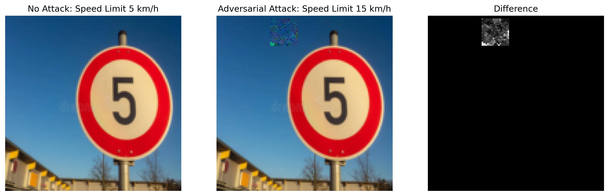

# Perceptually Transparent Adversarial Patches Generated by Genetic Algorithms to Fool Sign Classifiers

This project explores the generation of perceptually transparent adversarial patches using Genetic Algorithms, inspired by the paper "CamoPatch: An Evolutionary Strategy for Generating Camouflaged Adversarial Patches" published at NeurIPS 2023.

## Overview



Adversarial patches are physical objects or digital overlays that can cause deep learning models, particularly image classifiers, to misclassify inputs. Unlike traditional pixel-wise adversarial attacks, patches are localized and can be applied to physical objects in the real world.

Inspired by the innovative techniques presented in the CamoPatch paper, this project aims to generate adversarial patches that are not only effective at fooling a traffic sign classifier but are also designed to be more perceptually transparent, blending better with the background context they replace.

## Project Goals and Results

1.  **Train a Traffic Sign Classifier:** We trained a multi-class classifier on a traffic sign dataset sourced from Kaggle, achieving an accuracy of 96% on a 9-class test set.
2.  **Apply Adversarial Patch Attack:** Using the principles from CamoPatch, we applied the adversarial patching technique to generate patches designed to fool this trained classifier.
3.  **Demonstrate Attack Effectiveness:** The generated adversarial patches were highly effective, reducing the classifier's accuracy on patched images to 0% on the test set.

## Key Techniques (Inspired by CamoPatch)

The core of this project relies on several key techniques introduced in the CamoPatch paper:

* **Genetic Algorithm as a Search Strategy:** Instead of relying on gradient information from the target model (which requires a white-box setting), CamoPatch utilizes Genetic Algorithms (GA) as a powerful black-box optimization technique. GA evolves a population of potential patches over generations based on how well they fool the classifier.
* **Semi-Transparent Circular Patch Representation:** The adversarial patch is modeled as a circular area with learned RGB values and a learned alpha (transparency) value. This allows the patch to be superimposed onto the original image content while potentially letting some of the underlying context show through.
* **Perceptual Transparency Optimization:** After a patch successfully fools the classifier, an additional optimization step is performed. This step minimizes the L2 distance between the pixel values in the patched area and the original pixel values *before* the patch was applied. 

## Our Contributions

While building upon the foundation of the CamoPatch paper, our work includes the following specific contributions:

* **Evaluation on Traffic Sign Classification:** We specifically applied and evaluated this adversarial patching technique on a practical traffic sign classification task using a real-world dataset from Kaggle. This demonstrates the technique's effectiveness in other dataset (original paper assess on ImageNet)
* **Adaptation for "Real World Setting":** The original CamoPatch evaluation of potential patches within the Genetic Algorithm relies on having access to the full probability distribution or logits across *all* classes from the target classifier. This represents an "ideal world setting" which may not be available in real-world black-box scenarios where only the top-1 prediction and its confidence are returned (a "real world setting"). We adapted the fitness evaluation strategy within the Genetic Algorithm to function effectively using only the predicted class and its associated confidence, making the technique more broadly applicable in true black-box scenarios.


## Dataset

The traffic sign dataset used for training the classifier and evaluating the adversarial patches was obtained from Kaggle.

## Reproduce result

### Run experiement
```bash
#$python train.py --schedule --weight_decay 0.05
$python run_experiement.py --mode "idealW" --save_directory "log/idealW" 
$python run_experiement.py --mode "realW" --save_directory "log/realW" 
```

### See report
```bash
$python summary.py --result_folder <path to folder containing .npy files> 
```

## Usage 

```bash
$python run.py --image_dir <image path> --true_label <int> 
```